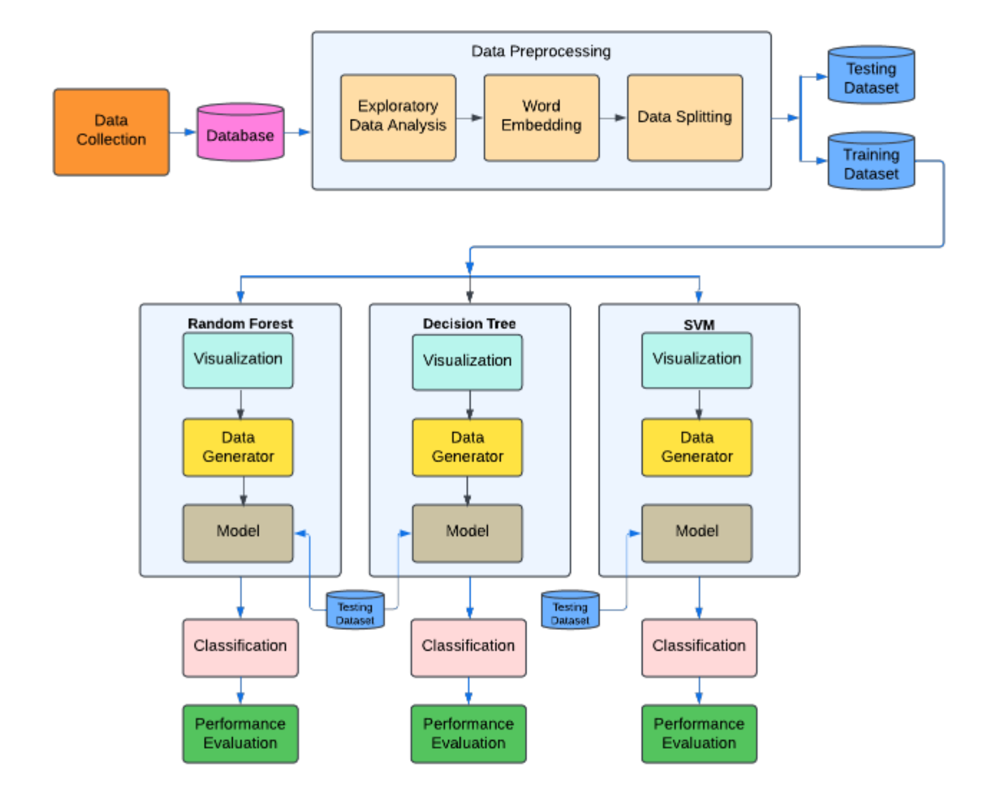
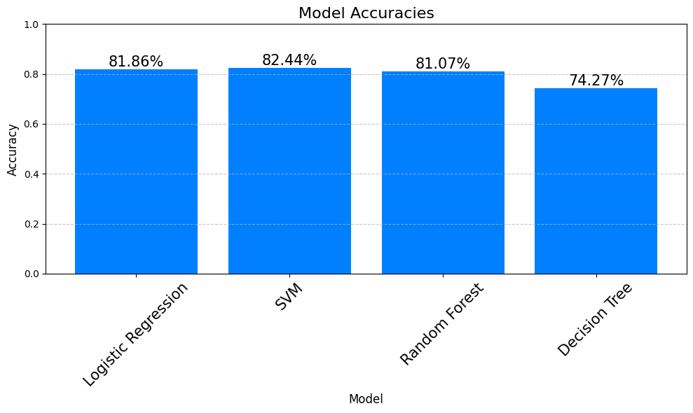
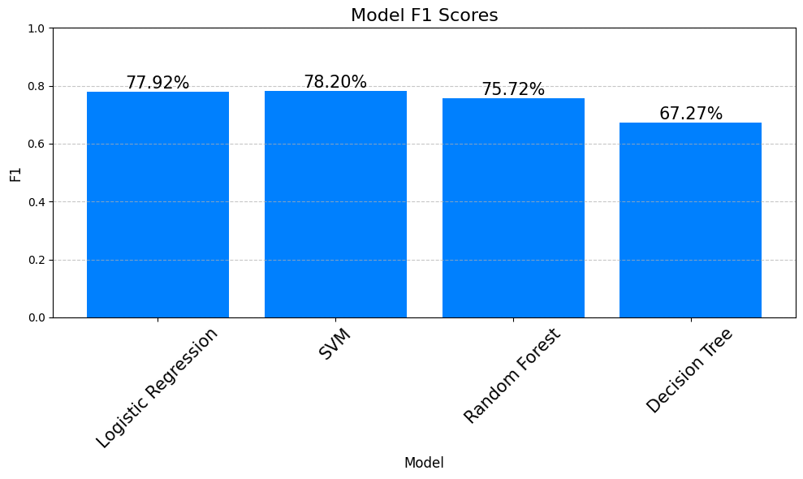
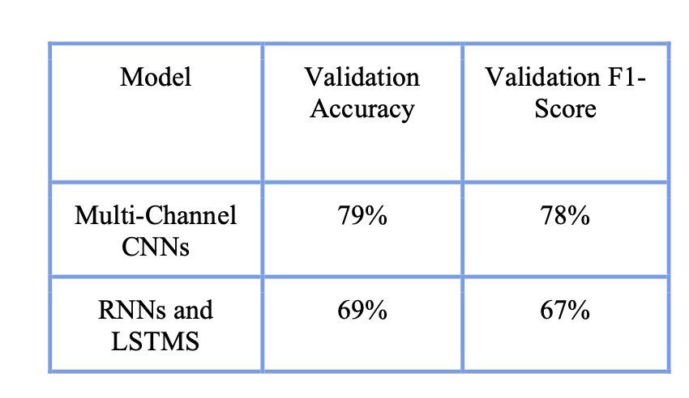

# Fundamentals of Data Science Project

This project uses machine learning and deep learning techniques to classify disaster related tweets. The primary objective was to identify whether a tweet is related to a disaster. To achieve this, we implemented and fine tuned multiple models, including multi channel CNNs, RNNs with LSTMs, and transformer based models like BERT. Each model was evaluated for its performance in terms of accuracy, loss, and F1 score. The project highlights challenges such as overfitting and hyperparameter optimization, and documents strategies adopted to overcome them.

### Block Diagram of System

## Our results

## Contributers
- Amirthavarshani Mahadevan
- Fiyinfoluwa Dideoluwa
- Flynn Heise
- Jarvis Chapman
- Milaan Williams
- Shiva Madhav Adusumilli